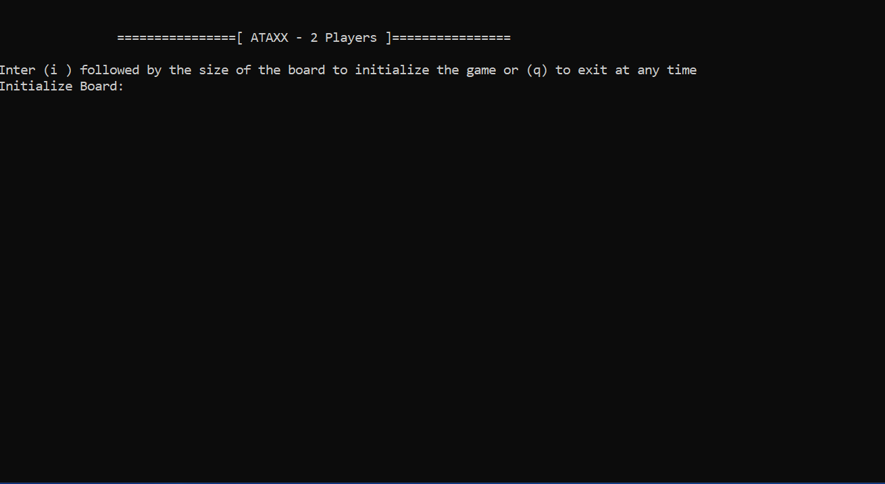

# Ataxx 
Console game.

This is my first program in C++ :hugs:

learning C++ through game development :woman_dancing:

With AlphaBeta Pruning & Transposition Table

## How to use:

1. Initialize your board: i n (n is from 4 to 8)
2. Set your board: s
3. Enter the board line by line (b,w are blue and white pieaces/ e is empty spaces/ x is blocks)
4. Play.

### How to play?

A. AI play route:
  - Enter 1 for mode 1 AI (AlphaBta Search) or 2 for mode 2 AI (NegaScout Search)
  - Enter the player to move (w or b)
  - Enter depth of search / or time to search (ft 10: fixed time of 10 seconds), (rt 100: remaining time of game is 100 seconds)
  - Start search: g
  
B.User Play route:
  - Enter Player to move (w/b)
  - enter move to play (ex: ma1a2) move from a1 to a2
  
C.Enter 'q' to quit the game at any time.

## DEMO:

